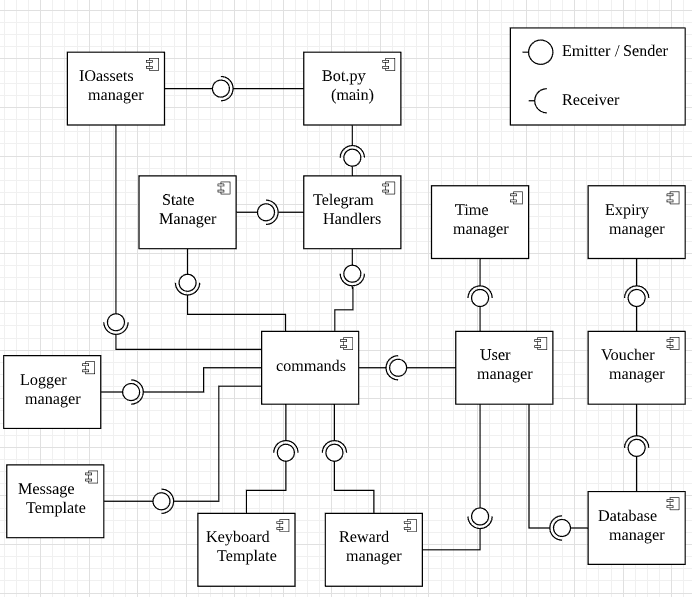
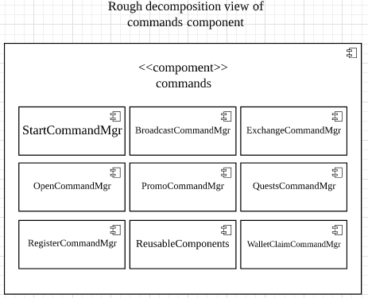
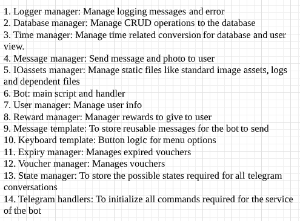

# Snapee Bot

## Project Description

This repository contains the source code for the Telegram bot ran by the company Snapee Pte Ltd.

Main features of the bot:

1. Exchange points (snapcoins) for vouchers
2. Redeem vouchers at retail shops or restaurants
3. Broadcast information to other registered users
4. Claim vouchers and points through promotion codes
5. Referral system
6. Manage points and vouchers in their wallet

This project is deprecated and archived for reference.

## Project Setup

Refer to the [setup guide](./assets/readme/setup.md) for more information on how to set up the Telegram bot server.

## Architecture Structure

The UML Component Diagram below provides an overview on how each script depends on each other:

A closer look at commands component

This proves a rough idea of the communication between scripts and to reduce the need to import unnecessary modules or
libraries for every script.

A brief explanation of the functionality of each components (May be changed in the future)

